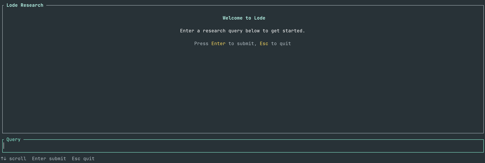

# Lode

Multi-agent research system that orchestrates AI agents to perform deep web research and synthesize comprehensive reports. Builds on the concepts taught in Week 2 of [Ed Donner's Agentic AI course](https://www.udemy.com/course/the-complete-agentic-ai-engineering-course/)



## Architecture

Lode uses a hybrid Rust/Python architecture:

```text
┌─────────────────────────────────────────────────────────────┐
│                        Rust CLI                             │
│  • Interactive TUI (default) or single-query mode           │
│  • Process orchestration                                    │
│  • Artifact storage (runs/<run_id>/)                        │
│  • Output formatting (human/json/quiet)                     │
└─────────────────────┬───────────────────────────────────────┘
                      │ JSON stdin/stdout
┌─────────────────────▼───────────────────────────────────────┐
│                     Python Runner                           │
│  • OpenAI API interaction                                   │
│  • Research logic (plan → search → synthesize)              │
│  • Multi-agent orchestration                                │
└─────────────────────────────────────────────────────────────┘
```

### Agents

Lode coordinates a fixed set of specialists:

| Agent | Role |
|-------|------|
| **Clarifier** | Asks exactly three questions to disambiguate the user’s intent before any API-heavy work starts |
| **Planner** | Generates a structured list of web searches tailored to the clarified query |
| **Search** | Runs each web search (via OpenAI WebSearchTool) and summarizes the findings concisely |
| **Evaluator** | Scores coverage/depth, flags gaps, and recommends whether more searches are needed |
| **Writer** | Turns the collected research into a final multi-page markdown report |

The **Orchestrator** agent wields **Planner** → **Search** → **Evaluator** → **Writer** as tools, looping until the evaluator says coverage is good, then handing off to the writer to produce the final report.

## Installation

### Prerequisites

- [Rust](https://rustup.rs/) (latest stable)
- [Python 3.12](https://www.python.org/)
- [uv](https://github.com/astral-sh/uv) (Python package manager)

### Setup

```bash
# Clone the repository
git clone https://github.com/dejisec/lode.git
cd lode

# Install Python dependencies
uv sync

# Build the Rust CLI
cd cli && cargo build --release
```

### Configuration

```bash
# Copy example environment file
cp env.example .env

# Edit .env with your OpenAI API key
OPENAI_API_KEY=sk-...
```

## Usage

### Interactive Mode (Default)

Run without arguments to launch the interactive TUI:

```bash
./cli/target/release/lode-cli
```

This opens a chat-like interface where you can submit multiple research queries in a session. The TUI displays real-time progress and renders research reports inline.

**Keyboard Controls:**

| Key | Action |
|-----|--------|
| `Enter` | Submit query |
| `Up/Down` | Scroll message history |
| `Esc` or `Ctrl+C` | Quit |

### Single Query Mode

Pass a query directly to run a one-off research task:

```bash
# Basic usage
./cli/target/release/lode-cli "What are the latest developments in quantum computing?"

# With custom model
./cli/target/release/lode-cli --model gpt-4o-mini "Explain CRISPR gene editing"

# Adjust search depth
./cli/target/release/lode-cli --search-count 10 "Climate change mitigation strategies"

# JSON output (for programmatic use)
./cli/target/release/lode-cli --json "Your query"

# Quiet mode (suppress progress, show only report)
./cli/target/release/lode-cli --quiet "Your query"
```

### CLI Options

```text
Usage: lode-cli [OPTIONS] [QUERY]...

Arguments:
  [QUERY]...  The research query (omit for interactive mode)

Options:
      --model <MODEL>                OpenAI model (default: gpt-4o, env: LODE_MODEL)
      --search-count <SEARCH_COUNT>  Number of searches (default: 5, env: LODE_SEARCH_COUNT)
      --no-auto                      Require manual confirmation before running research
      --json                         Output JSON lines instead of human-readable
  -q, --quiet                        Suppress progress, show only report and errors
  -h, --help                         Print help
```

## Artifacts

Each research run produces artifacts in `runs/<run_id>/`:

```text
runs/<run_id>/
  request.json       # Input parameters
  metadata.json      # Model, timing, trace info
  output.md          # Final markdown report
  prompts/
    001-planner.txt  # Planner input
    002-search.txt   # Search inputs
    ...
    007-writer.txt   # Writer input
  raw_responses/
    001-planner.json # Planner output (search plan)
    002-search.json  # Search outputs
    ...
    007-writer.json  # Writer output (report)
```

## Configuration Priority

1. CLI flags (`--model`, `--search-count`)
2. Environment variables (`LODE_MODEL`, `LODE_SEARCH_COUNT`)
3. Defaults (`gpt-4o`, `5`)

## Environment Variables

| Variable | Description | Default |
|----------|-------------|---------|
| `OPENAI_API_KEY` | OpenAI API key (required) | - |
| `LODE_MODEL` | Model to use | `gpt-4o` |
| `LODE_SEARCH_COUNT` | Number of web searches | `5` |

## API Costs

Lode uses the OpenAI WebSearchTool, costing 2.5 cents per call. However, OpenAI can sometimes charge for multiple searches for a single call, so it could sometimes cost more than 2.5 cents per call.

Costs are here: <https://platform.openai.com/docs/pricing#built-in-tools>
